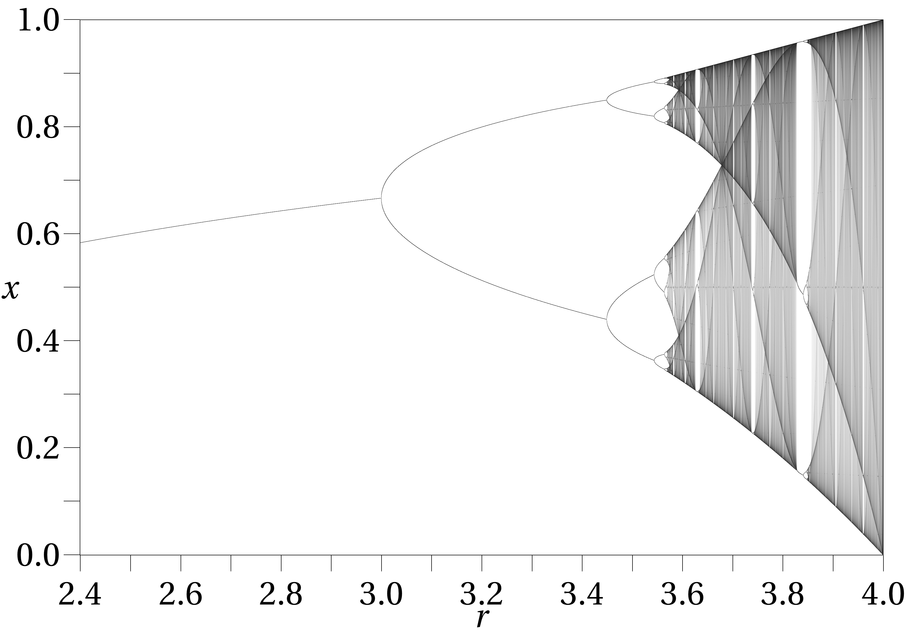
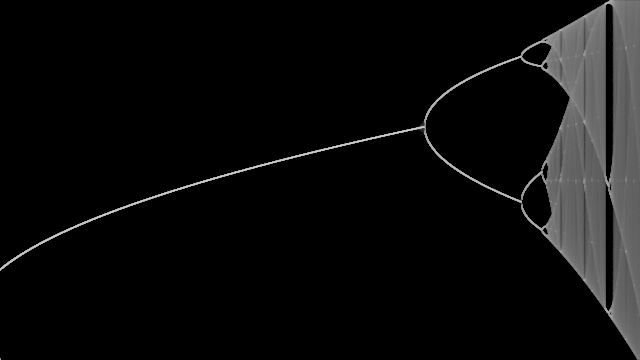

# Chaos

## Doppelpendel
 
 
## Lorenzattraktor
 

## Logistische Funktion 

[Logistische Funktion Geogebra](https://www.geogebra.org/m/mbznmn6k)

Bifurkationsdiagramm

[Quellen](Quellennachweis.pdf)
